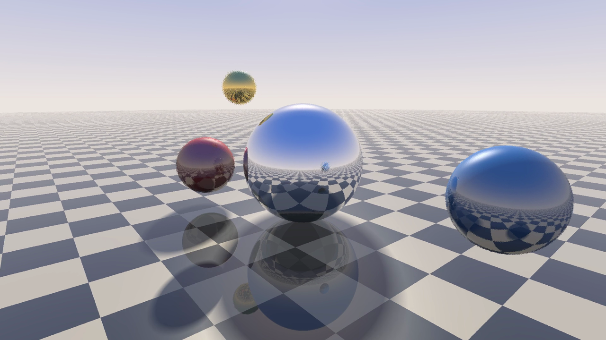

# COBOL Ray Tracer

A real-time ray tracer written in COBOL.


*12 seconds at 1080p, rendered entirely by COBOL. Full-quality mp4 on the
[releases page](../../releases).*

Four spheres (chrome, ruby, sapphire, gold) orbit and bounce over a checkerboard
floor while the camera circles them. Every pixel is a traced ray:

- recursive mirror reflections, up to 5 bounces (spheres reflected in spheres reflected in the floor)
- shadow rays toward the sun, with soft-edged penumbras
- Fresnel floor: more reflective at grazing angles
- Phong specular highlights, hemisphere ambient light, distance fog, sky gradient with sun glow
- tinted metal reflections (gold reflects gold)
- gamma-corrected 24-bit color

It runs two ways:

- **live in the terminal** at ~18 fps (100×60 pixels, Apple M1), using truecolor
  half-block characters so each character cell holds two pixels
- **offline to video**, streaming raw RGB frames to ffmpeg; `render.sh` splits the
  timeline across all CPU cores and produces a 1080p mp4 (about 32 s per 1080p
  frame per core; the 12-second demo takes ~30 minutes on an 8-core M1)

One source file, `raytrace.cob`. No C helpers, no libraries: just GnuCOBOL.

## Running it

Requires [GnuCOBOL](https://gnucobol.sourceforge.io/) 3.x (`brew install gnucobol`,
`apt install gnucobol`) and, for video, ffmpeg.

```sh
cobc -x -O2 -fno-binary-truncate -o raytrace raytrace.cob

./raytrace live                 # 100x30 cells, runs 60 seconds
./raytrace live 140 45 120      # COLS ROWS SECONDS
```

Live mode needs a truecolor terminal (iTerm2, WezTerm, kitty, Ghostty, recent
Terminal.app, most Linux terminals) at least as large as the requested size.

```sh
./render.sh                     # 1920x1080, 360 frames (12 s), all cores
./render.sh 1280 720 300 out.mp4
```

Or drive it by hand: `./raytrace video W H FIRST LAST` writes raw RGB24 frames
(on a 30 fps timeline) to stdout.

```sh
./raytrace video 640 360 0 299 | ffmpeg -f rawvideo -pix_fmt rgb24 -s 640x360 -r 30 -i - out.mp4
```

## How it's fast enough

COBOL was built for payroll, and GnuCOBOL evaluates almost all arithmetic through
an arbitrary-precision decimal library. Measured on an M1:

| operation | cost |
|---|---|
| `COMPUTE` dot product, binary integers | ~0.1 µs |
| same with `COMP-2` floating point | ~1.5 µs |
| `FUNCTION SQRT` | ~1.7 µs |

So the renderer is built around avoiding floats and square roots:

- **Fixed point.** All per-pixel math uses `PIC S9(9) COMP-5` integers where
  `4096` means `1.0`. Floating point is only used for per-frame setup (animation,
  camera basis), a few dozen operations per frame.
- **Square roots from a table.** For a unit ray direction, the ray-sphere
  discriminant `b² − c` can never exceed `r²`, so `sqrt` is a lookup into an
  8192-entry table built at startup.
- **Camera rays normalized once.** Each pixel's camera-space direction is
  normalized at startup. Rotating it into world space every frame preserves
  length, so there's no per-frame normalization.
- **Primary-ray terms hoisted.** Every primary ray starts at the camera, so
  `oc = eye − center` and `oc·oc − r²` are computed once per sphere per frame.
- **Shadow rays need no root.** Whether a sphere blocks the sun only needs the
  ray's closest-approach distance² compared with r²; values just above r² become
  the penumbra.
- **No recursion.** COBOL paragraphs can't recurse, so the reflection tree is a
  loop carrying per-channel throughput weights (which is also what makes tinted
  metal reflections cheap).
- **Early outs.** If `oc·d ≥ 0` the sphere is behind the ray; skip it.

### Fixed-point precision

The textbook discriminant `b² − c` subtracts two large, nearly equal numbers
(around 180,000 in fixed-point units for a sphere 7 units away). With ray
directions only accurate to 1/4096, the per-pixel rounding error was big enough
to make sphere silhouettes visibly furry. The fix is the numerically stable form
from *Ray Tracing Gems* (ch. 7): `disc = r² − |oc − b·d|²`, which only involves
small numbers. The cheap form is kept as a reject test, with a margin that grows
with `c`, so the stable form only runs for rays that might actually hit.



The terminal renderer only emits an ANSI color code when the color actually
changes from the previous cell, and writes each frame with a single `DISPLAY`.

## Prior art

As far as I could find, no ray tracer in COBOL had been published before this
one. A [Hacker News commenter](https://news.ycombinator.com/item?id=25700038) once
wrote: *"When someone manages to write a raytracer in COBOL I will be truly
impressed."*

The closest earlier work is [FPS.cob](https://github.com/icitry/FPS.cob) by
icitry, a Wolfenstein/DOOM-style raycasting shooter in COBOL that also streams
raw frames to an external player. Raycasting walks one ray per screen column
across a 2D map. This project traces full 3D rays per pixel, with reflections
and shadows.

## License

MIT
